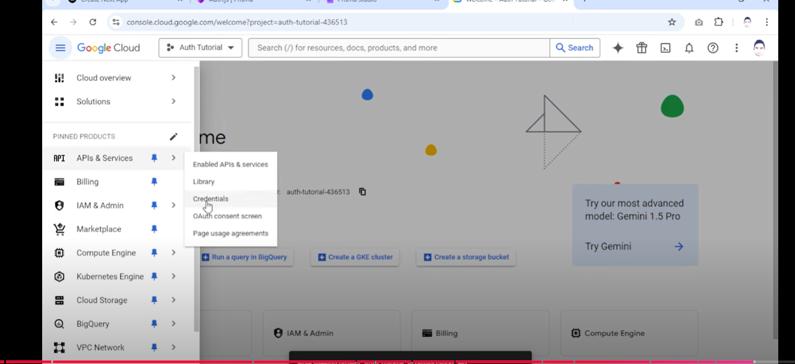

### step 1.

npm i -D prisma
npm i @prisma/client
npm i zod react-icons bcrypt-ts

npm i next-auth@beta
npm i @auth/prisma-adapter

npx prisma init

### step 2

got to vercel > storage > choose postgres and give a name create > env.local then copy and paste in your project > also go to prisma and copy url and directurl and paste in your project

### step 3

got to authjs installation
in env add AUTH_SECRET=""

create route handler inside /app/api/auth/[...nextauth]/route.ts
in root directory create middleware
then go to connection > adapter > prisma copy prima.ts configuration paste into your project
update AUTH.TS
under prisma copy schema and paste in schema.prisma

### step 4

create schema then migrate your schema
npx prisma migrate dev --name init
then npx prisma studio

### step 5

register page ui

### step 6

create validation and server action logic in zod.ts and action.ts

### step 7

then use signUpCredentials in form-register page

### step 8

customize session we got role and id

### step 9

to enable signin with google first got to https://console.cloud.google.com/ >
new project >in sidebar api & services > credentials  > click configuration consent screen button > choose external create > fill app name, email support ,dev contact > finaly save and continue > save and continue > back to dashboard > pusblish app > credentials >create credentials >OAuth client ID> appcn type(web) > name> authrized redirect url("http://localhost:3000/api/auth/callback/google) to get this got to authjs(authentication > OAuth >google copy callback) finaly create and copy client id and secret

### step 10

to enable signin with github
first got to github > setting > dev setting > OAuth Apps > fill name, homepage url(localhost:3000), auth callback url(http://localhost:3000/api/auth/callback/github) > register application > copy client id & generate secret > paste in env

### step 11

to fix this error in your url(happen when you try to login with the same email weather in github or google) use search params and display the error message , basically we have replaced this error to "OAuthAccountNotLinked" to custom error message

### step 12

deployment
add this under package.json under scripts
"postinstall": "prisma generate"

### step 13

    copy deployed url(https://multi-role-auth.vercel.app) then go to google cloud console   then click on edit   then paste on authorized javascript origin(https://multi-role-auth.vercel.app) also in authorized redirect url replace(http://localhost:3000 to https://multi-role-auth.vercel.app ) finally save 

### step 14

    copy deployed url(https://multi-role-auth.vercel.app) then go to githu.com auth app

replace(http://localhost:3000 TO https://multi-role-auth.vercel.app)  finally update application
